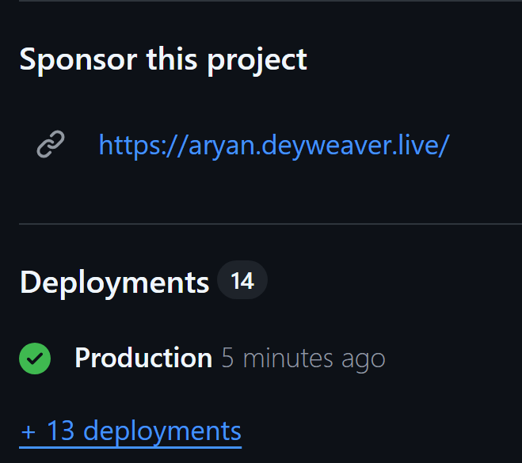

# Donation Page


A polished donation page for open‑source developers. Built with Next.js + Stripe. No database, no vendor lock‑in. Total raised is a simple text file you control.

<p align="left">
  
  
  
  
  
  <a href="https://pagespeed.web.dev/report?url=https://yourprojecturl.com">
    
  </a>
  <a href="https://summer.hackclub.com/projects/10572">
    
  </a>
</p>


[](https://vercel.com/new/clone?repository-url=https://github.com/aryan6673/donate&env=NEXT_PUBLIC_STRIPE_PUBLISHABLE_KEY,STRIPE_SECRET_KEY,STRIPE_WEBHOOK_SECRET,GITHUB_TOKEN)

## Why this exists
- For maintainers who want a clean, trustworthy way to accept donations.
- For teams who don’t want a database just to show a public “total raised”.
- For anyone who values clarity, speed, and ownership over their stack.

## What you get
- Stripe Elements + PaymentIntents (card, Apple/Google Pay via browser wallets; Cash App return_url wired).
- Required name/email, optional GitHub handle and public/private toggle.
- Out‑of‑the‑box success page with spinner → success/failed states.
- GitHub profile and repos section (uses optional `GITHUB_TOKEN` for higher rate limits).
- Total raised tile and a panel under the payment box.
- Zero database. Public total comes from `public/raised.txt` (integer cents).
- Glassmorphism UI, dark theme, accessible focus states.
- Friendly code, TypeScript, App Router.

## 30‑second setup
1) Use this template (or Fork) on GitHub.
2) Clone locally.
3) Create `.env.local` with your keys:
   - `NEXT_PUBLIC_STRIPE_PUBLISHABLE_KEY=pk_test_...`
   - `STRIPE_SECRET_KEY=sk_test_...`
   - `STRIPE_WEBHOOK_SECRET=whsec_...` (optional; from Stripe CLI or Dashboard)
   - Optional: `GITHUB_TOKEN=ghp_...` (for GitHub API rate limits)
   - `NEXT_PUBLIC_SITE_URL=https://your-deployed-domain` (used by sitemap/robots and metadata)
4) Set your starting total: edit `public/raised.txt` (integer cents, e.g., `0` or `12345`).
5) Install and run locally:
   - `npm install`
   - `npm run dev`
6) Optional (recommended) webhook for local testing:
   - `stripe listen --forward-to localhost:3000/api/stripe/webhook`
   - Put the printed `whsec_...` into `STRIPE_WEBHOOK_SECRET` and restart.

## How “total raised” works
- A single file `public/raised.txt` contains the public total as cents.
- The API routes `GET /api/donations` and `GET /api/stats` read this file and serve `totalRaisedCents`.
- No automatic aggregation from Stripe. You control the number. Update the file and deploy.

## Customize it
- Repo link (the top‑right GitHub corner): `src/app/layout.tsx`.
- Featured projects carousel/cards: `src/components/FeaturedCarousel.tsx`.
- Donation UI (tiers, slider, toggles): `src/components/DonateControl.tsx`.
- Hero copy and stats row: `src/components/Hero.tsx`.
- Success page message: `src/app/success/page.tsx`.
- Styling utilities and theme: `src/app/globals.css`.

## Key endpoints
- `POST /api/stripe/create-payment-intent` → Creates PaymentIntent.
- `GET/PATCH /api/stripe/intent` → Reads/updates PaymentIntent (metadata, receipt email).
- `POST /api/stripe/webhook` → Signature verified; returns 200 (no DB writes).
- `GET /api/github/profile` + `GET /api/github/repos` → Public GitHub data.
- `GET /api/donations` + `GET /api/stats` → Read `public/raised.txt`.

## Security & privacy
- Sensitive operations occur server‑side via Stripe SDK.
- No customer data is stored in this app. Donor name/email live in Stripe.
- Webhook is verified with your `STRIPE_WEBHOOK_SECRET`.

## Deploy
- One‑click: use the “Deploy with Vercel” button above.
- Or import the repo in Vercel, set env vars, and deploy. Ensure `public/raised.txt` exists in your repo.

---

## Add a Sponsor button to your GitHub repos
Here’s how it will look in your repo:

<p align="left">
  
</p>

Add the button that links to your donation page in 3 quick steps:

1) Get your donation URL
   - Deploy this site (e.g., on Vercel) and copy the URL, e.g., `https://your-donate-site.vercel.app`.

2) Create `.github/FUNDING.yml` in your repo
   - This file controls the Sponsor button.

```yml
# .github/FUNDING.yml
# Shows a Sponsor button on your repo header
# Replace with your deployed donation URL
custom:
  - https://your-donate-site.vercel.app
```

3) Commit and push
   - GitHub will show a “Sponsor” button that opens your donation page.

Optional
- Include your GitHub Sponsors handle (if you use GitHub Sponsors as well):
```yml
github: [ your-github-username ]
custom:
  - https://your-donate-site.vercel.app
```
- Organization-wide: put `.github/FUNDING.yml` in your org’s special `.github` repository to apply it to all repos that don’t have their own.


## Roadmap (you can pick these up)
- Optional donor wall sourced from Stripe charges/metadata.
- Real GitHub “commits this year” metric.
- Multi‑currency support.

## Contributing & License
- Issues and PRs welcome. See `CONTRIBUTING.md` and `CODE_OF_CONDUCT.md`.
- MIT License. See `LICENSE`.

Made with love by [aryan6673](https://github.com/aryan6673) ❤️


If this helps your project, star the repo and share it with another maintainer. One less blocker between your work and your supporters.

